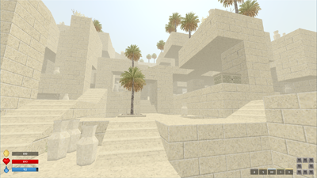
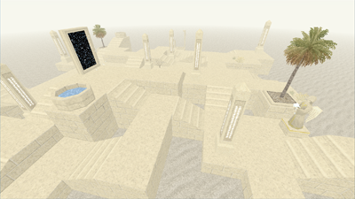
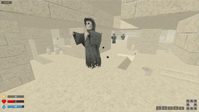
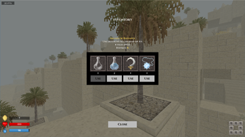
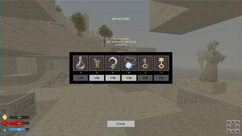
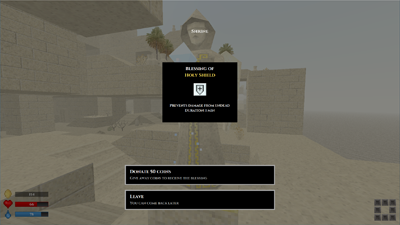
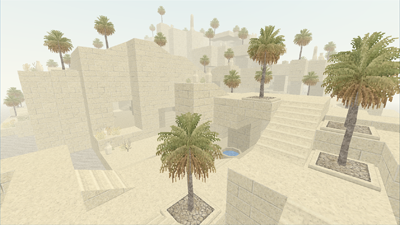
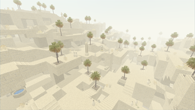

# Forgotten Ruins

_Rogue-like game featuring procedurally generated maze and 90s style 3D graphics._

## Download

[ForgottenRuins.zip](https://github.com/ashurrafiev/ForgottenRuins/releases/download/a.0.9/ForgottenRuins.zip) (3.86 MB)

## Game Objective

Find and activate all 8 _Obelisks_ to open the _Exit Portal_. Interact with the portal (right-click) to exit to the next level.
There are a total of 10 increasingly difficult levels.

Optional: Decode all tablets.

## This is an early preview

The following limitations are in place:

* No options menu (edit the [config](ruins.cfg) file instead).
* Controls cannot be changed.
* No sound.

## Controls

* **W, A, S, D** - Move
* **SPACE** - Jump
* **RMB** - Interact
* **TAB** - Inventory
* **ESC** - Pause/Menu

Item hotkeys:

* **Q** - Healing Herbs
* **E** - Amulet of Escape
* **R** - Amulet of Radiance
* **F** - Water Flask

To unlock hardcore mode, add `unlockHardcore: true` to [config](ruins.cfg).
