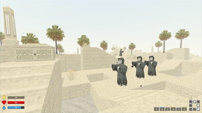
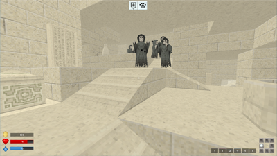

# Forgotten Ruins

_Rogue-like game featuring procedurally generated maze and 90s style 3D graphics._

## Download

[ForgottenRuins.zip](https://github.com/ashurrafiev/ForgottenRuins/releases/download/pre-a.0.5/ForgottenRuins.zip) (3.67 MB)

## Game Objective

Find and activate all 8 _Obelisks_ to open the _Exit Portal_. Interact with the portal (right-click) to complete the level.

Optional: Decode all tablets.

## This is an early preview

The following limitations are in place:

* Only one level.
* Game difficulty is set to hard to showcase later levels of the game.
* No options menu (edit the [config](ruins.cfg) file instead).
* Controls cannot be changed.
* No sound.

## Controls

* **W, A, S, D** - Move
* **SPACE** - Jump
* **RMB** - Interact
* **TAB** - Inventory
* **ESC** - Pause/Menu

Item hotkeys:

* **Q** - Healing Herbs
* **E** - Amulet of Escape
* **R** - Amulet of Radiance
* **F** - Water Flask
